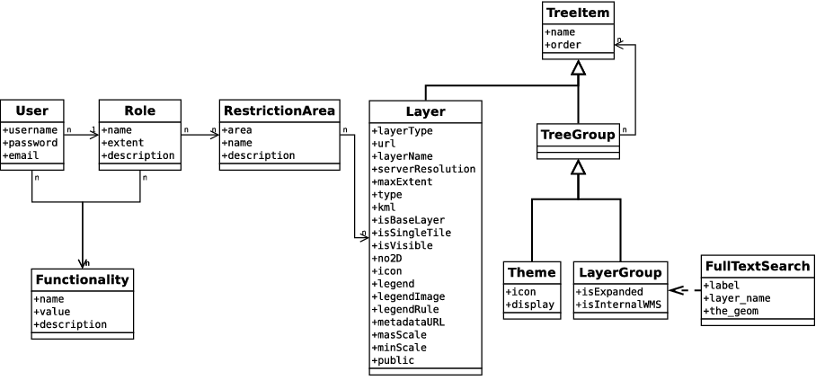

.. _developer_server_side:

Server-side development
=======================

Create development environment in a project
-------------------------------------------

c2cgeoportal developers often need to test c2cgeoportal changes in the context
of an existing c2cgeoportal application. Here is how:

* Change current directory to your sources root directory and clone
    ``c2cgeoportal`` there (in the following line the sources directory is the
    user home directory). Then checkout the submodules, build c2cgeoportal,
    and go back to your project directory:

  .. prompt:: bash

    cd ~
    git clone git@github.com:camptocamp/c2cgeoportal.git
    cd c2cgeoportal
    git submodule update --init
    make build
    cd  ~/<project>

  You can now check out your development branch if necessary.

* Edit your ``<user>.mk`` to have something like this:

  .. code:: make

    INSTANCE_ID = <user>
    DEVELOPMENT = TRUE
    REQUIREMENTS = -e ../c2cgeoportal

    include <package>.mk

* Uninstall the regular c2cgeoportal egg from the virtual environment:

  .. prompt:: bash

    .build/venv/bin/pip uninstall c2cgeoportal

* Remove/comment the following line in the CONST_requirements.txt file:

  .. code:: make

    c2cgeoportal==1.6.0

* Build your application application:

  .. prompt:: bash

    rm .build/requirements.timestamp && make -f <user>.mk build

.. note:: Print performance issue

   When restarting the print server frequently, performance issues may randomly be observed.
   This is done in random number generation.

   To improve the performances you should add in the ``/srv/tomcat/tomcat1/bin/setenv-local.sh`` file:

   .. code:: bash

      export ADD_JAVA_OPTS="-Djava.security.egd=file:/dev/./urandom"

Tests
-----

Running tests
~~~~~~~~~~~~~

To be able to run c2cgeoportal tests you need to have the c2cgeoportal source
code, and a make environment for it. So do that first, as described below.

Install c2cgeportal from source
...............................

Check out c2cgeoportal from GitHub:

.. prompt:: bash

    git clone git@github.com:camptocamp/c2cgeoportal.git

Change into the ``c2cgeoportal`` directory and initialize the submodules:

.. prompt:: bash

    cd c2cgeoportal
    git submodule update --init

c2cgeoportal has two types of tests: unit tests and functional tests. The unit
tests are self-contained, and do not require any specific setup. The functional
tests require to run with `docker-compose-run`.

Unit tests
..........

To run the unit tests do this:

.. prompt:: bash

    make build
    ./docker-run nosetests -a '!functional'

Functional tests
................

For the functional tests you need to have MapServer and PostgreSQL/PostGIS
installed. Make sure this is the case before proceeding.

You now need to create PostGIS database (named ``geomapfish_test`` for example)
and a schema named ``main`` into it.

To create the database use the following command if you have a PostGIS database
template at your disposal:

.. prompt:: bash

    sudo -u postgres createdb -T template_postgis geomapfish_test

.. note::

    If you do not have a template named ``template_postgis`` use this:

    .. prompt:: bash

        sudo -u postgres createdb -E UTF8 -T template0 geomapfish_test
        sudo -u postgres createlang plpgsql geomapfish_test
        sudo -u postgres psql -d geomapfish_test \
               -f /usr/share/postgresql/9.1/contrib/postgis-1.5/postgis.sql
        sudo -u postgres psql -d geomapfish_test \
               -f /usr/share/postgresql/9.1/contrib/postgis-1.5/spatial_ref_sys.sql
        sudo -u postgres psql -d geomapfish_test \
               -c 'GRANT ALL ON geometry_columns TO "www-data";'
        sudo -u postgres psql -d geomapfish_test \
               -c 'GRANT SELECT ON spatial_ref_sys TO "www-data";'

    The ``template0`` is needed on Debian and Ubuntu to create a utf-8
    database.

If you do not have a ``www-data`` user you need to create one:

.. prompt:: bash

    sudo -u postgres createuser -P www-data

To create the ``main``,  ``main_static``  and ``geodata`` schema:

.. prompt:: bash

    sudo -u postgres psql -d geomapfish_test -c 'CREATE SCHEMA main;'
    sudo -u postgres psql -d geomapfish_test -c 'GRANT ALL ON SCHEMA main TO "www-data";'
    sudo -u postgres psql -d geomapfish_test -c 'CREATE SCHEMA main_static;'
    sudo -u postgres psql -d geomapfish_test -c 'GRANT ALL ON SCHEMA main_static TO "www-data";'
    sudo -u postgres psql -d geomapfish_test -c 'CREATE SCHEMA geodata;'
    sudo -u postgres psql -d geomapfish_test -c 'GRANT ALL ON SCHEMA geodata TO "www-data";'

If you do not use the default variables edit the ``vars.yaml`` and set the ``dbuser``, ``dbpassword``,
``dbhost``, ``dbport``, ``db``, and ``mapserv_url`` as appropriate.

``mapserv_url`` needs to refer a valid ``mapserv`` instance running locally,
i.e. on the machine you run the tests on. For example, if you use your desktop
machine it may be ``http://locahost/cgi-bin/mapserv``.

.. note::

    On Camptocamp servers ``mapserv`` is usually not available on the
    ``localhost`` virtual host. One option involves creating a specific script
    alias for ``mapserv``, for example by adding something like the following
    to your ``/var/www/<virtual_host_name>/conf/mapserv.conf`` file:

    .. code::

        ScriptAlias /mapserv /usr/lib/cgi-bin/mapserv
        <Location /mapserv>
            SetHandler fcgid-script
        </Location>

    To know what domain name to use look at the ``ServerAlias``'es
    configured for the virtual host in
    ``/etc/apache2/sites-enabled/<virtual_host_name>``.

    Here is an example of a possible ``mapserv_url``:
    ``http://mapfish-geoportal-demo/mapserv``.

Once done with the editing of ``vars.yaml``, run ``make``
to generate ``c2cgeoportal/tests/functional/test.ini`` and
``c2cgeoportal/tests/functional/c2cgeoportal_test.map``:

.. prompt:: bash

    make build

You can now run the functional tests with this:

.. prompt:: bash

    ./docker-compose-run nosetests -a functional

All tests
.........

To run all the tests do this:

.. prompt:: bash

    ./docker-compose-run make tests

To run a specific test use the ``--where`` switch. For example:

.. prompt:: bash

    ./docker-compose-run nosetests --where \
        /src/c2cgeoportal/tests/functional/test_themes.py:TestThemesView.test_catalogue

Adding tests
~~~~~~~~~~~~

**To Be Done**

Upgrade dependencies
--------------------

When we start a new version of c2cgeoportal or just before a new development
phase it is a good idea to update the dependencies.

Eggs
~~~~

All the ``c2cgeoportal`` (and ``tilecloud-chain``) dependencies are present in
the ``c2cgeoportal/scaffolds/update/CONST_versions.mako`` file.

To update them you can simply get them from a travis build in the
``.build/venv/bin/pip freeze`` task.

Submodules
~~~~~~~~~~

Go to the OpenLayers folder:

.. prompt:: bash

    cd c2cgeoportal/static/lib/openlayers/

Get the new revision of OpenLayers:

.. prompt:: bash

    git fetch
    git checkout release-<version>

Then you can commit it:

.. prompt:: bash

    cd -
    git add c2cgeoportal/static/lib/openlayers/
    git commit -m "update OpenLayers to <version>"

Database
--------

Object model
~~~~~~~~~~~~

.. source file is database.dia.
   export from DIA using the type "PNG (anti-crénelé) (*.png)", set the width to 1000px.

``TreeItem`` and ``TreeGroup`` are abstract (cannot be create) class used to create the tree.

``FullTextSearch`` references a first level ``LayerGroup`` but without any constrains.

it is not visible on this schema, but the ``User`` of a child schema has a link (``parent_role``)
to the ``Role`` of the parent schema.

``metadata`` vs ``functionality``
....................................

Technically the same ``functionality`` can be reused by more than one element.

``functionalities`` are designed to configure and customize various parts of
the application. For instance to change the default basemap when a new theme
is loaded.

To do that in the CGXP application we trigger an event when we load a theme the
new ``functionnalities``.

The ``metadata`` contains attributes that are directly related to the element.
For example the layer disclaimer, ...

Migration
~~~~~~~~~

We use the ``alembic`` module for database migration. ``alembic`` works with a
so-called *migration repository*, which is a simple directory in the
application source tree:``CONST_alembic``. As the ``CONST_`` prefix suggests
this repository is part of the ``c2cgeoportal_update`` scaffold, it is created
or updated when this scaffold is applied. So developers who modify the
``c2cgeoportal`` database schema should add migration scripts to the
``c2cgeoportal_update`` scaffold, as opposed to the application.

Add a new script call from the application's root directory:

.. prompt:: bash

    .build/venv/bin/alembic --config alembic[_static].ini revision --message "<Explicit name>"

Or in c2cgeoportal root directory:

.. prompt:: bash

    .build/venv/bin/alembic \
        --config c2cgeoportal/tests/functional/alembic[_static].ini \
        revision --message "<Explicit name>"

This will generate the migration script in ``CONST_alembic/versions/xxx_<Explicite_name>.py``
You should *NOT* commit the script in this directory because this migration
script should be shared with all c2cgeoportal projects.
It is the c2cgeoportal ``update`` template which is responsible for updating
this directory.

The script should not get any part of the ``c2cgeoportal.model`` module!

To get the project schema use:
``schema = context.get_context().config.get_main_option('schema')``

The scripts should not fail if it is run again. See:
http://alembic.readthedocs.org/en/latest/cookbook.html#conditional-migration-elements

Then customize the migration to suit your needs, test it:

.. prompt:: bash

    .build/venv/bin/alembic upgrade head

Once you have tested it, move it to the c2cgeoportal ``update`` template, in
``c2cgeoportal/scaffolds/update/CONST_mlembic/versions/``.

More information at:
 * http://alembic.readthedocs.org/en/latest/index.html
 * http://alembic.readthedocs.org/en/latest/tutorial.html#create-a-migration-script
 * http://alembic.readthedocs.org/en/latest/ops.html

Sub domain
----------

All the static resources used sub domains by using the configurations variables:
``subdomain_url_template`` and ``subdomains``.

To be able to use sub domain in a view we should configure the route as this::

    from c2cgeoportal.lib import MultiDomainPregenerator
    config.add_route(
        '<name>', '<path>',
        pregenerator=MultiDomainPregenerator())

And use the ``route_url`` with an additional argument ``subdomain``::

    request.route_url('<name>', subdomain='<subdomain>')}",

Code
----

Coding style
~~~~~~~~~~~~

Please read http://www.python.org/dev/peps/pep-0008/.

And run validation:

.. prompt:: bash

    make checks

Dependencies
------------

Major dependencies docs:

* `SQLAlchemy <http://docs.sqlalchemy.org/>`_
* `GeoAlchemy2 <http://geoalchemy-2.readthedocs.org/>`_
* `Formalchemy <http://docs.formalchemy.org/>`_
* `GeoFormAlchemy <https://github.com/camptocamp/GeoFormAlchemy/blob/master/GeoFormAlchemy/README.rst>`_
* `alembic <http://alembic.readthedocs.org/>`_
* `Pyramid <http://docs.pylonsproject.org/en/latest/docs/pyramid.html>`_
* `Papyrus <http://pypi.python.org/pypi/papyrus>`_
* `MapFish Print <http://www.mapfish.org/doc/print/index.html>`_
* `reStructuredText <http://docutils.sourceforge.net/docs/ref/rst/introduction.html>`_
* `Sphinx <http://sphinx.pocoo.org/>`_
