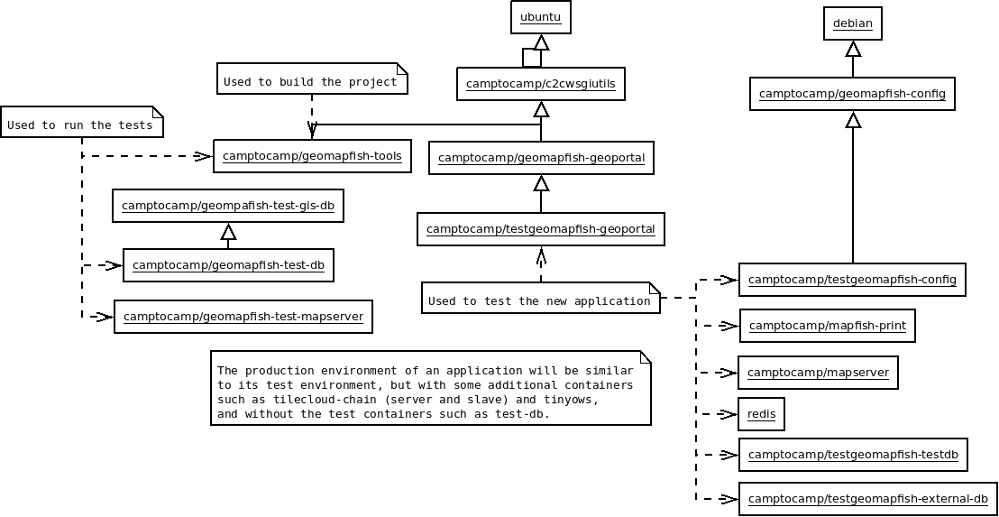

.. _developer_server_side:

Server-side development
=======================

Create development environment in a project
-------------------------------------------

c2cgeoportal developers often need to test c2cgeoportal changes in the context
of an existing c2cgeoportal application. Here is how:

Build the new containers:

.. prompt:: bash

    git clone git@github.com:camptocamp/c2cgeoportal.git
    cd c2cgeoportal
    make docker-build

Now, the new containers are ready to use in the application on the same host.

Tests
-----

Running tests
~~~~~~~~~~~~~

Prerequisite: to be able to run c2cgeoportal tests, you need to have the c2cgeoportal source
code, and a make environment for building the library.

c2cgeoportal has two types of tests: unit tests and functional tests. The unit
tests are self-contained, and do not require any specific setup. The functional
tests require to run with ``docker-compose-run``.

docker-run will:

* Run the given command in the docker build image.
* Mount the current directory in /src.
* Use the current user and home directory.
* Use a named volume related to the current folder in ``/build``.

docker-compose will also:

* Create a test database and a test MapServer.

Docker image dependencies:

.. source file is docker.dia.

Image nomenclature:

* ``camptocamp/geomapfish-*`` for all images generated by/for c2cgeoportal.
* ``camptocamp/geomapfish-test-*`` for all images used only for the CI (not pushed on a Docker repository).
* ``camptocamp/testgeomapfish-*`` for all images used by the CI to
    test applications generated using scaffolds.

Unit tests
..........

Before running the tests, install and build all dependencies:

.. prompt:: bash

    ./docker-run make prepare-tests

Run the tests:

.. prompt:: bash

    ./docker-compose-run make tests

To run only a specific test, use the ``-k`` switch. For example:

.. prompt:: bash

    ./docker-compose-run py.test -k test_catalogue geoportal/tests

To run the tests for the ``geomapfish_qgisserver`` plugin using dedicated
docker image and composition:

.. prompt:: bash

    make -C docker/qgisserver tests

See ``docker/qgisserver/README.md`` for more information.

Database
--------

Object model
~~~~~~~~~~~~

.. image:: database.png
.. source file is database.dia.
   export from DIA using the type "PNG (anti-crénelé) (*.png)", set the width to 1000px.

``TreeItem`` and ``TreeGroup`` are abstract (cannot be created) classes used to create the tree.

``FullTextSearch`` references a first level ``LayerGroup``, but without any constraints.

``metadata`` vs ``functionality``
....................................

The same ``functionality`` can be reused by more than one element.

``functionalities`` are designed to configure and customize various parts of the application.
For instance, via a functionality you can define which basemap is to be used when a new theme is loaded.

The ``metadata`` contains attributes that are directly related to the element.
For example the layer disclaimer, ...

Migration
~~~~~~~~~

We use the ``alembic`` module for database migration. ``alembic`` works with a
so-called *migration repository*, which is a simple directory ``/opt/alembic`` in the
docker image. So developers who modify the ``c2cgeoportal`` database schema should add migration scripts.

Add a new script call from the application's root directory:

.. prompt:: bash

    ./docker-compose-run alembic \
        --name=[main|static] revision --message "<Explicit name>"

Or in c2cgeoportal root directory:

.. prompt:: bash

    ./docker-compose-run alembic \
        --config=geoportal/tests/functional/alembic.ini \
        --name=[main|static] revision --message "<Explicit name>"

This will generate the migration script in
``commons/c2cgeoportal/commons/alembic/[main|static]/xxx_<Explicite_name>.py``.

To get the project schema, use:
``schema = context.get_context().config.get_main_option('schema')``

The scripts should not fail if they are run more than once. See:
https://alembic.readthedocs.org/en/latest/cookbook.html#conditional-migration-elements

Then, customize the migration to suit your needs, test it:

.. prompt:: bash

    ./docker-compose-run alembic upgrade head

More information at:
 * https://alembic.readthedocs.org/en/latest/index.html
 * https://alembic.readthedocs.org/en/latest/tutorial.html#create-a-migration-script
 * https://alembic.readthedocs.org/en/latest/ops.html

Code
----

Coding style
~~~~~~~~~~~~

Please read https://www.python.org/dev/peps/pep-0008/.

And run validation:

.. prompt:: bash

    ./docker-run make checks

Dependencies
------------

Major dependencies docs:

* `SQLAlchemy <https://docs.sqlalchemy.org/>`_
* `GeoAlchemy2 <https://geoalchemy-2.readthedocs.org/>`_
* `alembic <https://alembic.readthedocs.org/>`_
* `Pyramid <https://docs.pylonsproject.org/en/latest/docs/pyramid.html>`_
* `Papyrus <https://pypi.python.org/pypi/papyrus>`_
* `MapFish Print <https://mapfish.github.io/mapfish-print-doc/>`_
* `reStructuredText <https://docutils.sourceforge.net/docs/ref/rst/introduction.html>`_
* `Sphinx <https://sphinx.pocoo.org/>`_
