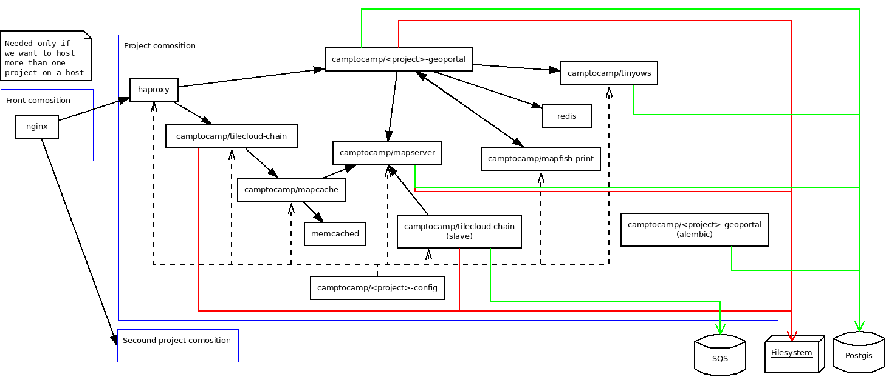

.. _integrator_docker:

Use Docker to deploy your application
=====================================

Architecture schema
-------------------

.. source file is docker.dia.

Configure your project
----------------------

Edit the ``<package>.mk`` file and add those lines:

.. code:: make

    DOCKER = TRUE
    DOCKER_BASE = camptocamp/<project_name>
    JASPERREPORTS_VERSION = 6.1.1

After that, a ``make --makefile=<xxx.mk> build`` will create Docker images named like
that:

* camptocamp/<project_name>_wsgi:latest
* camptocamp/<project_name>_mapserver:latest
* camptocamp/<project_name>_print:latest

The tag is by default ``latest``, but you can change it by setting the
``DOCKER_TAG`` Makefile variable.

Edit ``vars_<package>.yaml`` and add:

.. code:: yaml

    dbhost: db
    dbhost_slave: db

Database container
------------------

You can add scripts to populate the DB container by adding ``.sql`` or ``.sh``
files in the ``testdb`` directory. They must start with 2 digits, followed by
an underscore. Please start at number 20.

Developer composition
---------------------

A ``docker-compose.yml.mako`` file is created as a starting point.

If you want to host the database on your local machine, you must add a
``dbhost`` and ``dbhost_slave`` entry pointing to ``172.17.0.1`` (your host address for Docker
container) in your ``vars_<package>.yaml`` file. Then you need to make sure
Postgres is configured to listen on that interface and accepts authentication.

If you want to use an external serveur for the database, just put it is address
in the ``dbhost`` and ``dbhost_slave`` entry.

Run the developer composition
-----------------------------

.. prompt:: bash

    make --makefile=<xxx.mk> build && docker-compose up

You can then access your application with http://localhost:8480/

Run with a local c2cgeoportal
-----------------------------

If you need to fix bugs in c2cgeoportal or test new features, you need to hack
the Docker image creation to use your version of c2cgeoportal.

First, you need to move/copy you c2cgeoportal clone into you project root
directory. That is needed to allow Docker to see those files.

Then, add this line to your ``<package>.mk`` file (before the ``include ...``):

.. code:: make

    TEMPLATE_EXCLUDE = c2cgeoportal

Edit your ``.dockerignore`` file and add those lines at the end:

.. code:: docker

    !c2cgeoportal/c2cgeoportal*
    !c2cgeoportal/setup.*
    !c2cgeoportal/requirements.txt

Finally, edit your ``Dockerfile`` and add those lines just before the step #2:

.. code:: docker

    COPY c2cgeoportal /app/c2cgeoportal
    RUN pip install --editable=c2cgeoportal

Make your Docker images configurable from the composition
---------------------------------------------------------

WSGI
....

To make the DB connection used by your WSGI configurable from the
composition, you can add this in your ``vars_<package>.yaml`` file:

.. code:: yaml

    hooks:
      after_setup: {{package}}.after_setup_hook

Then, in your ``<package>/__init__.py`` file, add this function:

.. code:: python

    def after_settings_hook(settings):
        DB_KEY = "sqlalchemy.url"
        orig = settings[DB_KEY]
        new = os.environ.get("SQLALCHEMY_URL", orig)
        settings[DB_KEY] = new

By setting the ``SQLALCHEMY_URL`` environment variable in your composition
for the WSGI image, you'll be able to change the DB connection used.

You can change your ``production.ini`` and ``development.ini`` files to use
environment variables for configuring the loggers. Here is an example for
the part about the logging:

.. code::

    [loggers]
    keys = root, sqlalchemy, c2cgeoportal

    [handlers]
    keys = console, logstash

    [formatters]
    keys = generic

    [logger_root]
    level = %(OTHER_LOG_LEVEL)s
    handlers = %(LOG_TYPE)s

    [logger_c2cgeoportal]
    level = %(C2C_LOG_LEVEL)s
    handlers =
    qualname = c2cgeoportal

    [logger_sqlalchemy]
    level = %(SQL_LOG_LEVEL)s
    handlers =
    qualname = sqlalchemy.engine

    [handler_console]
    class = StreamHandler
    args = (sys.stdout,)
    level = NOTSET
    formatter = generic

    [formatter_generic]
    format = %(levelname)-5.5s %(message)s

    [handler_logstash]
    class = cee_syslog_handler.CeeSysLogHandler
    args = [("%(LOG_HOST)s", %(LOG_PORT)s)]
    level = NOTSET

Please note that to use
``CeeSysLogHandler`` you need to add ``cee_syslog_handler>=0.3.3`` to your
dependencies.

Define default values for all those environment variables in your
``Dockerfile`` and then you can change them in your composition. For example
add the following at the end of your ``Dockerfile``:

 .. code::

    ENV LOG_TYPE console
    ENV LOG_HOST localhost
    ENV LOG_PORT 514
    ENV C2C_LOG_LEVEL WARN
    ENV SQL_LOG_LEVEL WARN
    ENV OTHER_LOG_LEVEL WARN

MapServer
.........

The created ``mapserver/Dockerfile`` file installs a hook to make the setup of
the DB possible. Just set the ``DB_CONNECTION`` environment variable to
something like that:

.. code:: docker

    environment:
      DB_CONNECTION: user=www-data password=toto dbname=geoacordaDev host=db

To have the right URL in the GetCapabilities:

* In the Admin interface configure an OGC server with the URL: "http://mapserver/mapserv_proxy".

* In the project vars file add this:

  .. code:: yaml

    vars:
        ...
        host_formard_host:
        - mapserver

Keep your DB schema up to date
------------------------------

The WSGI image contains Alembic. You can use it as a start once container and
add something like that in your composition:

.. code:: yaml

    alembic:
      labels:
        io.rancher.container.start_once: 'true'
      image: company/prefix_wsgi:tag
      environment:
        SQLALCHEMY_URL: postgresql://postgres:${DB_PASSWORD}@db:5432/${DB_NAME}
      links:
        - db
      command: ./run_alembic.sh

When you do an upgrade, backup your DB and upgrade this container first. It will update your
DB schema, if needed.
