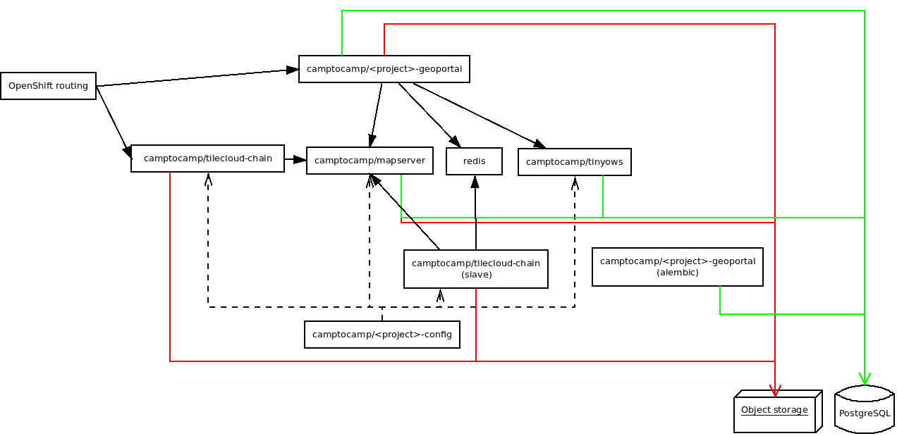
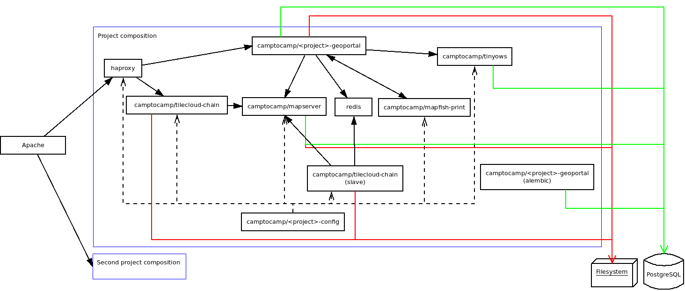

.. _integrator_docker:

Use Docker to deploy your application
=====================================

Architecture schema
-------------------

For OpenShift projects:

.. source file is docker-openshift.dia.

For stand alone projects:

.. source file is docker-apache.dia.

Images
------

When we build the project it will generate the following images:

* ``camptocamp/<package>_geoportal:latest``
* ``camptocamp/<package>_config:latest``

The tag is by default ``latest``, but you can change it by setting the ``DOCKER_TAG`` Makefile variable.

Docker compose files
--------------------

``docker-compose.yaml``: The main file that describes the composition.
``docker-compose-lib.yaml``: Provide the base description of Geomapfish Docker services.
``.env``: Build from ``env.sample`` the environment variable used by the composition.
``docker-compose.override[.sample].yaml``: Some rules for debuggung.
``.env``: The variable used in the compose files.

Run the developer composition
-----------------------------

.. prompt:: bash

   docker-compose up -d

You can then access your application with `https://localhost:8484/ <https://localhost:8484/>`_.

Clean
-----

Docker does not clean anything automatically, in particular it does not clean any images,
therefore disk space may become problematic after a certain number of builds.
You can use the following commands to manually remove Docker files.

Use ``docker system prune`` to clean files; you can add the ``--all`` option to do a deeper clean.

Environment variables
---------------------

The GeoMapFish containers can be customised with some environment variables:

Config::

 * ``VISIBLE_WEB_HOST``: The web host visible by the browser e.-g.: 'example.com'.
 * ``VISIBLE_ENTRY_POINT``: The web path visible by the browser e.-g.: '/main/', default is '/'.
 * ``PGSCHEMA``: The postgres schema, used by mapserver.
 * ``GEOPORTAL_INTERNAL_URL``: Used by the print in non mutualised mode.
 * ``TILECLOUDCHAIN_INTERNAL_URL``: Used by the print in non mutualised mode.
 * ``ST_JOIN``: Can be ``ST_Collect`` (default) or ``ST_Union``, ``ST_Collect`` is better for performance but
   does not support restriction area intersection.

Geoportal::

 * ``VISIBLE_ENTRY_POINT``: The web path visible by the browser e.-g.: '/main/', default is '/'.
 * ``PGSCHEMA``: The postgres schema, used by mapserver.
 * ``AUTHTKT_TIMEOUT``: See: :ref:`integrator_authentication`.
 * ``AUTHTKT_REISSUE_TIME``: See: :ref:`integrator_authentication`.
 * ``AUTHTKT_MAXAGE``: See: :ref:`integrator_authentication`.
 * ``AUTHTKT_SECRET``: See: :ref:`integrator_authentication`.
 * ``AUTHTKT_COOKIENAME``: See: :ref:`integrator_authentication`.
 * ``AUTHTKT_HTTP_ONLY``: See: :ref:`integrator_authentication`.
 * ``AUTHTKT_SECURE``: See: :ref:`integrator_authentication`.
 * ``AUTHTKT_SAMESITE``: See: :ref:`integrator_authentication`.
 * ``BASICAUTH``: See: :ref:`integrator_authentication`.
 * ``LOG_TYPE``: Should be 'console' with Docker Compose and 'json' with OpenShift.
 * ``LOG_LEVEL``: Log level for your application, default is ``INFO``, can be
   ``DEBUG``, ``INFO``, ``WARNING``, ``ERROR``, ``CRITICAL`` or ``NOTSET``,
   see also the ``production.ini`` file and the
   `logging documentation <https://docs.pylonsproject.org/projects/pyramid/en/1.5-branch/narr/logging.html>`_.
 * ``C2CGEOPORTAL_LOG_LEVEL``: Log level for all c2cgeoportal modules, default is ``WARN``.
 * ``C2CWSGIUTILS_LOG_LEVEL``: Log level for c2cwsgiutils, default is ``INFO``.
 * ``GUNICORN_LOG_LEVEL``: Log level for Gunicorn, default is ``INFO``.
 * ``SQL_LOG_LEVEL``: Log level for the Sqlalchemy engine``, default is ``WARN``.
 * ``DOGPILECACHE_LOG_LEVEL``: Log level for Dogpile cache, default is ``INFO``.
 * ``OTHER_LOG_LEVEL``: Log level for other modules, default is ``WARN``.

QGIS server::

 * ``GEOMAPFISH_CONFIG``: The GeoMapFish config file, default is ``/etc/qgisserver/geomapfish.yaml``.
 * ``GEOMAPFISH_OGCSERVER``: The OGC server name in single QGIS project mode.
 * ``GEOMAPFISH_ACCESSCONTROL_CONFIG``: The access control config file for multi QGIS project mode.
 * ``GEOMAPFISH_POSITION``: The plugin position, Default is ``100``.
 * ``LOG_LEVEL``: Log level for the GeoMapFish plugins, see also the ``logging.ini`` file.
 * ``C2CGEOPORTAL_LOG_LEVEL``: Log level for all c2cgeoportal modules, default is ``INFO``.
 * ``C2CWSGIUTILS_LOG_LEVEL``: Log level for c2cwsgiutils, default is ``INFO``.
 * ``SQL_LOG_LEVEL``: Log level for the Sqlalchemy engine``, default is ``WARN``.
 * ``OTHER_LOG_LEVEL``: Log level for other modules, default is ``WARN``.
 * ``QGIS_SERVER_LOG_LEVEL``: Qgis server log level, default is ``2``, ``0`` for verbose.
 * Other QGIS server environment variables
   <https://docs.qgis.org/testing/en/docs/user_manual/working_with_ogc/server/config.html>`_.
 * ``CPL_VSIL_CURL_USE_CACHE``: GDAL option, default is ``TRUE``.
 * ``CPL_VSIL_CURL_CACHE_SIZE``: GDAL option, default is ``128000000``.
 * ``CPL_VSIL_CURL_USE_HEAD``: GDAL option, default is ``FALSE``.
 * ``GDAL_DISABLE_READDIR_ON_OPEN``: GDAL option, default is ``TRUE``.
 * Other GDAL environment variables
   <https://gdal.org/user/configoptions.html#list-of-configuration-options-and-where-they-apply>`_.
